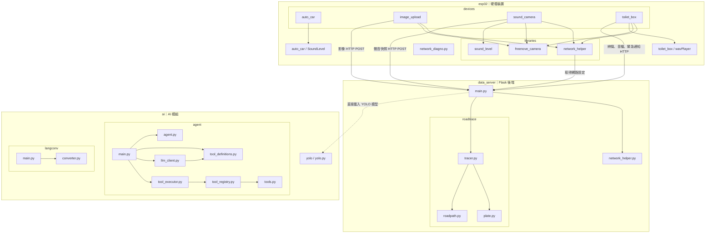

```mermaid
flowchart TB

    subgraph ESP["esp32｜硬體裝置"]

        direction TB

        subgraph DEV["devices"]

            CAR["auto_car"]

            IMG["image_upload"]

            SOUND["sound_camera"]

            TOILET["toilet_box"]

        end

        subgraph LIB["libraries"]

            NET["network_helper"]

            CAMERA["freenove_camera"]

            LEVEL["sound_level"]

        end

        WAV["toilet_box / wavPlayer"]

        LOCAL["auto_car / SoundLevel"]

        DIAG["network_diagno.py"]

    end

  

    subgraph SERVER["data_server｜Flask 後端"]

        MAIN["main.py"]

        NETH["network_helper.py"]

        subgraph ROAD["roadtrace"]

            TRACER["tracer.py"]

            PLATE["plate.py"]

            PATH["roadpath.py"]

        end

    end

  

    subgraph AI["ai｜AI 模組"]

        subgraph AGENT["agent"]

            AGMAIN["main.py"]

            CORE["agent.py"]

            LLM["llm_client.py"]

            EXEC["tool_executor.py"]

            REG["tool_registry.py"]

            TOOLS["tools.py"]

            DEF["tool_definitions.py"]

        end

        subgraph LANG["langconv"]

            LANGMAIN["main.py"]

            CONV["converter.py"]

        end

        YOLO["yolo / yolo.py"]

    end

  

    IMG --> NET

    IMG --> CAMERA

    SOUND --> NET

    SOUND --> CAMERA

    SOUND --> LEVEL

    TOILET --> NET

    TOILET --> CAMERA

    TOILET --> WAV

    CAR --> LOCAL

  

    NET -->|"取得網路設定"| MAIN

    IMG -->|"影像 HTTP POST"| MAIN

    SOUND -->|"聲音快照 HTTP POST"| MAIN

    TOILET -->|"辨識、音檔、緊急通知 HTTP"| MAIN

  

    MAIN --> NETH

    MAIN --> TRACER

    TRACER --> PLATE

    TRACER --> PATH

  

    MAIN -.->|"直接載入 YOLO 模型"| YOLO

  

    AGMAIN --> CORE

    AGMAIN --> LLM

    AGMAIN --> EXEC
    AGMAIN --> DEF
    LLM --> DEF
    EXEC --> REG
    REG --> TOOLS
    LANGMAIN --> CONV
```
